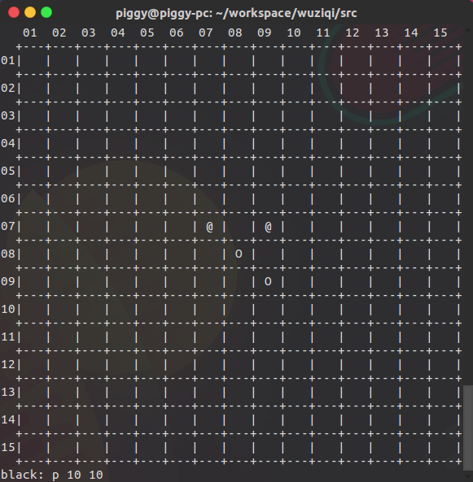

五子棋
=====

简易 Java 五子棋实现, 有终端字符组成的图形界面



使用手册
------

左下角表示要下的棋子的颜色，用坐标表示棋子的位置，横向为 x 坐标，纵向为 y 坐标，输入格式为：[option] x y，[option]、x 和 y 之间用空格隔开，输入完按下回车就会显示在绘制的棋盘上，O 表示黑棋，@ 表示白棋

输入 retract　则可以悔棋

运行
---

进入 src 目录编译，执行

``` javac *.java ```


然后执行

``` java wuziqi ```

运行程序

TODO
----

- ~~悔棋操作~~
- AI 对手

GOBANG
======

An easy gobang program which has an easy UI.


How to use
----------

The lower left quarter means the color of chess piece which you will put. Coordinate the position of the chess. Row is x, and rank is y. Input format:[option] x y. There is a blank between [option], x and y. Finally, press Enter. The chess piece will be painted on the chessboard. O says black. @ says white.

You can input "retract" to retract.

How to run
----------

Enter the src file to compile

``` javac *.java ```

then run the program

``` java wuziqi ```

TODO
----

- ~~retract~~
- AI player
